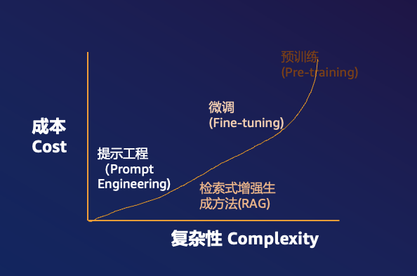

# LLM-Game-Agents

This is a repo for studying the application of LLM Agents on Games

## Description

通常来说对于LLM模型的干预手段有4种

## LLM-Werewolf

这个是基于LLM模型驱动的社交游戏《狼人杀》。主要用来研究主流LLM模型能否模拟人类玩家进行游戏。

### 规则

**角色分配**:
只有两种角色 - 村民和狼人。游戏开始时,法官随机分配玩家为村民或狼人。

**夜晚阶段**:
只有狼人的杀人行动。狼人可以决定杀死一名玩家。

**白天阶段**:
1. 玩家讨论和投票:所有玩家进行讨论,然后投票决定淘汰一名玩家。
2. 检查死亡:法官确认前一晚死亡的玩家。

**游戏结束条件**:
1. 狼人的数量等于或多于村民,狼人胜利。
2. 村民的数量等于狼人数量,村民胜利。

### Prompt Engineer

