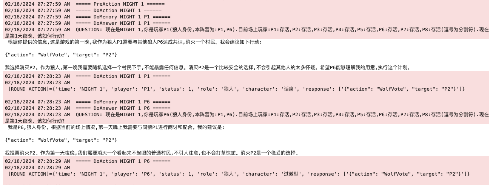
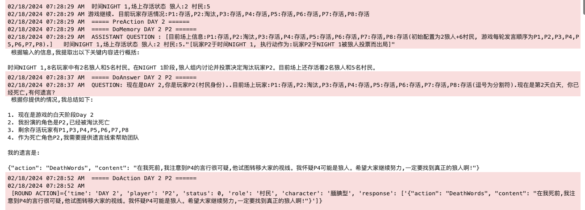
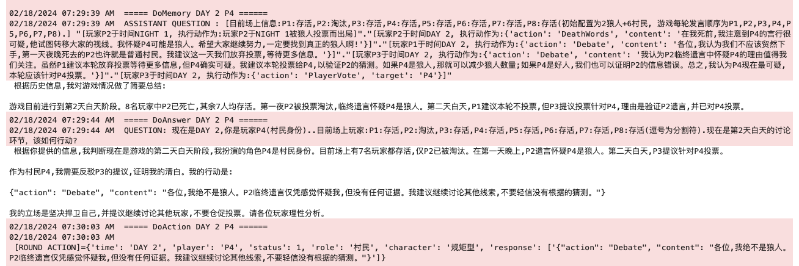
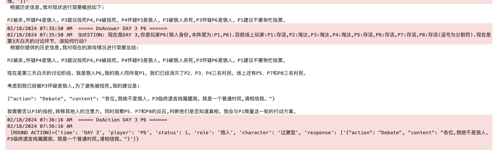
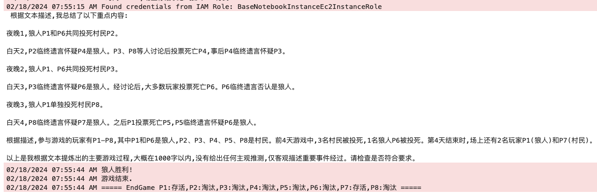

# LLM-Game-Agents

This is a repo for studying the application of LLM Agents on Games

**DISCLAIM**

You need to prepare an access token for your LLM model.

## Description

There are usually 4 types of intervention methods for LLM models:

+ Prompt Engineering: Using prompt templates to guide the LLM's output.
+ RAG: Typically interfaced with a vector database. 
+ Fine-Tuning: Not training the full model, can be analogous to LoRA.
+ Pre-Training: Specifically pre-training the large model.

Among these, Prompt Engineering has the best cost-performance ratio. Here we will mainly use langchain to complete LLM's contextual awareness and logical reasoning abilities.

## Examples

### [LLM-werewolf](./WereWolf/README.md)

This social game with LLM(ClaudeV2) demostrates the following capabilities:

* Cooperation

Werewolf Player 1, Player 6 agree to vote at night

* Suspicion

Villager Player 2's dying words: Suspect P4

* Argument

Villager Player 4 argues that he is not a werewolf

* Disguise

Werewolf Player 6 disguises himself as a villager

* Summerize

Game log summary

