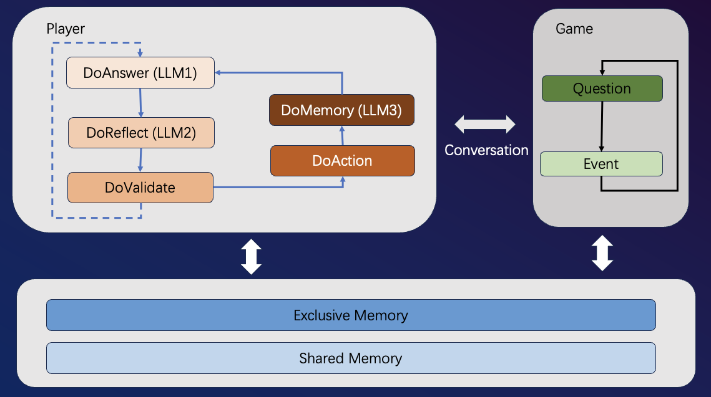

# LLM-Game-Agents

This is a repo for studying the application of LLM Agents on Games

**DISCLAIM**

You need to prepare an access token for your LLM model.

## Description

There are usually 4 types of intervention methods for LLM models:

+ Prompt Engineering: Using prompt templates to guide the LLM's output.
+ RAG: Typically interfaced with a vector database. 
+ Fine-Tuning: Not training the full model, can be analogous to LoRA.
+ Pre-Training: Specifically pre-training the large model.

Among these, Prompt Engineering has the best cost-performance ratio. Here we will mainly use langchain to complete LLM's contextual awareness and logical reasoning abilities.

## LLM-Werewolf-EN

This is a social deduction game "Werewolf" driven by LLM models. It is mainly used to study whether mainstream LLM models can simulate human players to play the game.

### Rules 

**Role Assignment**:
There are only two roles - villagers and werewolves. At the start of the game, the moderator randomly assigns players as villagers or werewolves.

**Night Phase**:
Only the werewolves have a kill action. Werewolves decide which player to kill.

**Day Phase**:
1. Players discuss and vote: All players discuss then vote to eliminate one player.
2. Check for deaths: The moderator confirms players that died the previous night.

**Game End Conditions**:
1. If the number of werewolves is equal to or greater than villagers, the werewolves win.
2. If the number of villagers equals the werewolves, the villagers win.

### Implementation

Currently the game contains two important modules: Game + Player

The Game module is responsible for driving the process, including
+ Initializing game configuration and players
+ Controlling game pace, invoking the Player module at appropriate times to get responses  
+ Checking game win conditions

The Player module is responsible for communicating with the LLM
+ Q&A + Memory: Using **langchain ConversationBufferWindowMemory** to complete prompt templating
+ Summarize + Reasoning: Recording key events (voting, discussion, etc), summarizing and reasoning before answering each question

## LLM-Werewolf-CN

这个是基于LLM模型驱动的社交游戏《狼人杀》。主要用来研究主流LLM模型能否模拟人类玩家进行游戏。

### 规则

**角色分配**:
只有两种角色 - 村民和狼人。游戏开始时,法官随机分配玩家为村民或狼人。

**夜晚阶段**:
只有狼人的杀人行动。狼人可以决定杀死一名玩家。

**白天阶段**:
1. 玩家讨论和投票:所有玩家进行讨论,然后投票决定淘汰一名玩家。
2. 检查死亡:法官确认前一晚死亡的玩家。

**游戏结束条件**:
1. 狼人的数量等于或多于村民,狼人胜利。
2. 村民的数量等于狼人数量,村民胜利。

### 实现

#### 第一个版本

为了简单，第一个版本的法官由程序控制，玩家为LLM配置，采用**2狼+5村民**的模式, 具体的配置如下:

~~~
{
  "players": [
    {
      "name": "P1",
      "role": "狼人",
      "character": "思维缜密",
      "status": 1
    },
    {
      "name": "P2",
      "role": "狼人", 
      "character": "沉默寡言",
      "status": 1
    },
    {
      "name": "P3",
      "role": "村民",
      "character": "能说会道",
      "status": 1
    },
    {
      "name": "P4",
      "role": "村民",
      "character": "逻辑清晰",
      "status": 1
    },
    {
      "name": "P5",
      "role": "村民",
      "character": "思维跳跃",
      "status": 1
    },
    {
      "name": "P6",
      "role": "村民",
      "character": "心不在焉", 
      "status": 1
    },
    {
      "name": "P7",
      "role": "村民",
      "character": "喜欢附和", 
      "status": 1
    }
  ]
}
~~~

游戏的框架还是由程序驱动，会在规定的时间几点调用以下问题模版，比如:
~~~
{
    "player": {
        "action_plan_night": "{0} {1} 现在是第{2}天夜晚，该如何行动?",
        "action_plan_day": "{0} {1} 现在是第{2}天白天的讨论环节，该如何行动?",
        "action_plan_day_vote": "{0} {1} 现在是第{2}天白天的投票环节，该如何行动?",
        "action_plan_death": "现在是第{0}天白天，玩家已经死亡,有何遗言?",
        "action_confirm": "收到",
        "action_villager_team": "未知,需要你推理发现.",
        "action_reflect": "{0} {1} 该如何思考?",
        "action_plan_test": "现在全场几人活着几人淘汰"
    },
    "god": {
        "action_plan_night": "{0}现在是第{1}天夜晚，你该如何行动？",
        "action_plan_day": "{0}现在是第{1}天白天，你该如何行动？",
        "action_plan_test": "现在全场几人活着几人淘汰"
    },
    "system": {
        "death_night": "昨晚, 玩家{0}被狼人淘汰, 遗言为:{1}.",
        "death_day": "今天, 玩家{0}被玩家淘汰, 遗言为:{1}.",
        "win_wolf": "狼人胜利!",
        "win_villager": "村民胜利!",
        "win_none": "游戏继续. 目前玩家存活情况:{0}",
        "board": "现在玩家存活情况:{0}"
    }
}
~~~
+ 其中 **player** 模块为针对玩家LLM提出的问题
+ 其中 **god** 模块为针对上帝LLM提出的问题（TBD）
+ 其中 **system** 模块为系统消息，会广播给所有的LLM

#### 模块

目前游戏包含两个重要模块: 游戏 + 玩家

游戏模块负责驱动进程，包括
+ 初始化游戏配置以及玩家
+ 控制游戏节奏，在合适的时间点调用玩家模块来获取回答
+ 检测游戏胜利条件

玩家模块负责和LLM通讯
+ 问答 + 记忆: 利用 **langchain ConversationBufferWindowMemory** 完成提示词模版
+ 总结 + 推理: 记录关键事件（投票，讨论等），每次回答问题前进行总结和推理

