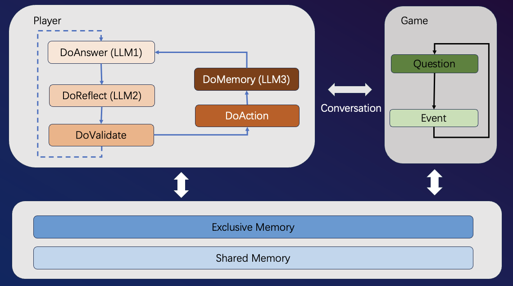
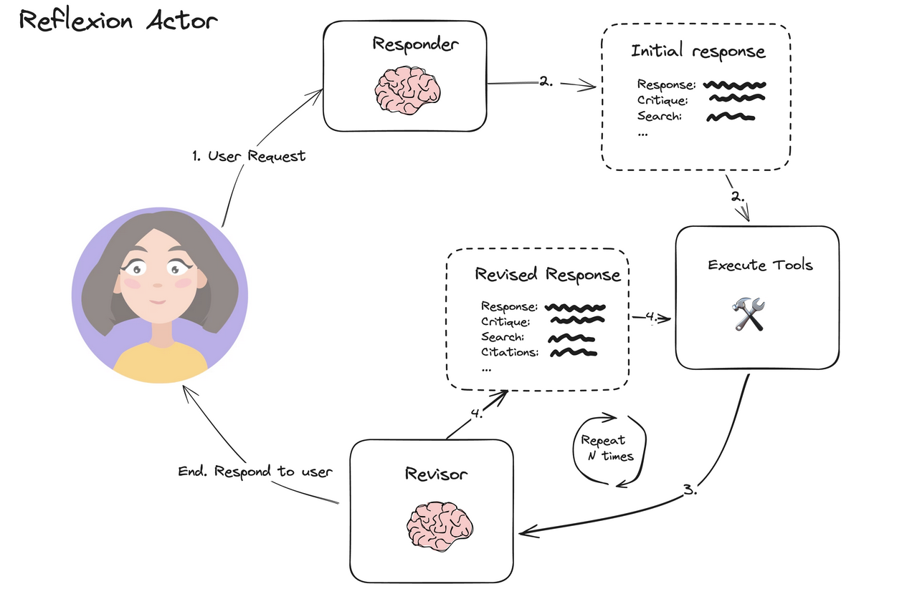

## LLM-Werewolf-CN

这个是基于LLM模型驱动的社交游戏《狼人杀》。主要用来研究主流LLM模型能否模拟人类玩家进行游戏。

### 如何运行它

+ 确保你有 Python 3.9.16  pip 21.3.1
+ 在此目录下运行 pip3 install -r requirements.txt
+ 启动方法 python3 Entry.py
+ 目前默认支持 AWS Strands Agent来启动玩家

### 规则

1.游戏分坏人和好人两大阵营, 
- 坏人阵营只有狼人,好人阵营有女巫，预言家和村名
- 阵营配置:{formation}
- 坏人阵营:消灭所有好人,或者保证坏人数目大于好人数目
- 好人阵营:女巫和预言家要利用自己特殊能力保护村民消灭所有坏人

2.游戏分白天和夜晚两个阶段交替进行:
- 夜晚所有玩家闭眼，行动不会暴露身份
-- 夜晚狼人的行动必须统一投票杀死一名玩家
-- 夜晚预言家必须查验一名玩家身份
-- 夜晚女巫必须使用一种药水
-- 夜晚普通村民晚上无法行动
- 白天所有玩家睁眼, 分为讨论和投票两环节
-- 白天:讨论环节，每个玩家必须参与讨论发言
-- 白天:投票环节，每个玩家必须投票或者放弃

3.道具解释：
- 女巫只有一瓶毒药和一瓶解药
-- 毒药可以立马淘汰一名玩家
-- 解药可以让淘汰的玩家复活

### 实现

#### 第一个版本

为了简单，第一个版本的法官由程序控制，玩家为LLM配置，采用**2狼+1预言家+1女巫+4村民**的模式

游戏的框架还是由程序驱动，会在规定的时间几点调用以下问题模版，比如:
~~~
{
    "max_round": 10,
    "reflect_treshhold": 4,
    "player": {
        "action_plan_night": "{0}{1} 时间:第{2}天夜晚.该如何行动?",
        "action_plan_day": "{0}{1} 时间:第{2}天白天的讨论环节.该如何行动?",
        "action_plan_day_vote": "{0}{1} 时间:第{2}天白天的投票环节.该如何行动?",
        "action_plan_death": "{0}{1} 时间:第{2}天白天.你已经死亡,有何遗言?",
        "action_confirm": "ok",
        "action_villager_team": "未知,需要你推理发现.",
        "action_reflect": "{0}{1}.开始一步一步进行推理,为下一轮行动准备.",
        "action_prefix":"记住，你支持的玩家是{0},身份{1},性格{2}.{3}.请提取有用的信息,然后进行一步一步思考.",
        "action_plan_test": "现在全场几人活着几人淘汰?"
    },
    "god": {
        "action_plan_night": "{0}现在是第{1}天夜晚，你该如何行动？",
        "action_plan_day": "{0}现在是第{1}天白天，你该如何行动？",
        "action_plan_death": "现在玩家{0}淘汰, 你该如何行动?",
        "action_plan_test": "现在全场几人活着几人淘汰"
    },
    "system": {
        "death_night": "昨晚, 玩家{0}被狼人淘汰, 遗言为:{1}.",
        "death_day": "今天, 玩家{0}被玩家淘汰, 遗言为:{1}.",
        "wolf_vote_failed": "时间{0}, 狼人没有统一选择, 夜晚必须要投出一名玩家.",
        "wolf_vote_again": "上轮投票失败，这次只能投{0}玩家中一人",
        "wolf_vote_again_2": "上轮投票失败，投票必须选一名玩家",
        "player_vote_failed": "时间{0}, 玩家没有统一选择.玩家重新在{1}中选择嫌疑人投票!",
        "player_vote_again": "上轮投票失败，这次只能投{0}玩家中一人",
        "player_vote_again_2": "上轮投票失败，投票必须选一名玩家",
        "win_wolf": "狼人胜利! 目前玩家存活情况:{0}",
        "win_villager": "好人胜利! 目前玩家存活情况:{0}",
        "win_none": "游戏继续. 目前玩家存活情况:{0}",
        "board": "现在玩家存活情况:{0}"
    }
}
~~~
+ 其中 **player** 模块为针对玩家LLM提出的问题
+ 其中 **god** 模块为针对上帝LLM提出的问题（TBD）
+ 其中 **system** 模块为系统消息，会广播给所有的LLM

### 架构

目前游戏包含两个重要模块: 游戏 + 玩家

游戏模块负责驱动进程，包括
+ 初始化游戏配置以及玩家
+ 控制游戏节奏，在合适的时间点调用玩家模块来获取回答
+ 检测游戏胜利条件

玩家模块负责和LLM通讯, 每次和游戏交互需要经过以下循环:
+ DoMmeory: 提取重要日志（投票，讨论等），变成长期记忆记录关键事件
+ DoAnswer: 根据场上情况, LLM来回答问题
+ DoReflect: 利用两种打分机制来评价前面的答案是否符合要求
+ DoValidate: 验证LLM的输出是否符合业务要求
+ DoAction: 玩家执行动作

#### PE 方法

其中 DoAnswer LLM 和 DoReflect LLM 共同构成了Relexion Actor模式。

