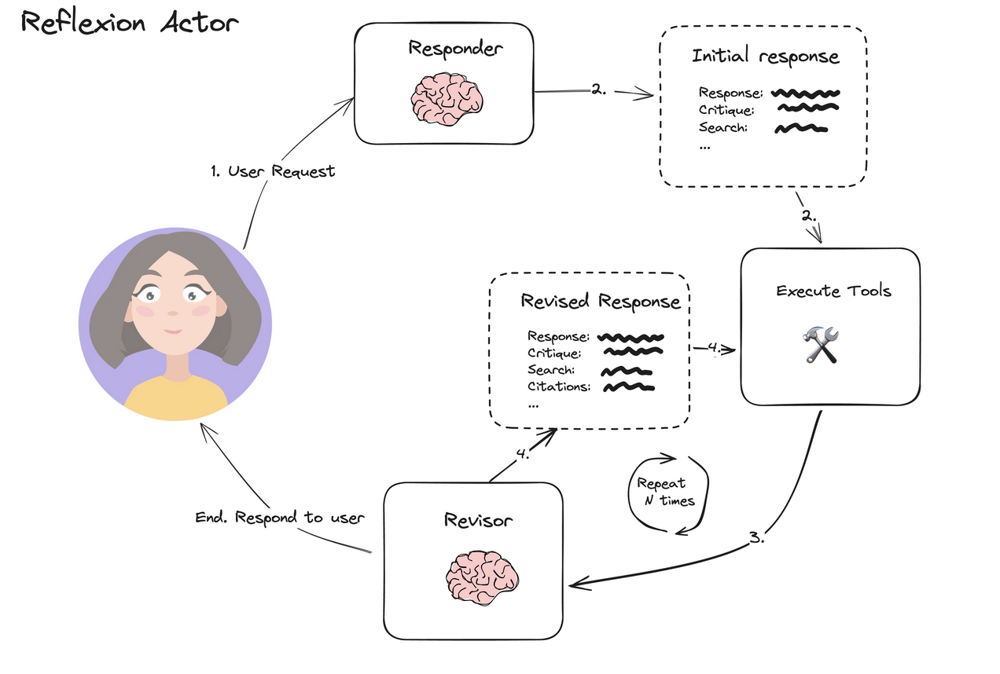

## LLM-Werewolf-EN

This is a social game 'Werewolf' driven by LLM models. The main purpose is to study whether mainstream LLM models can simulate human players in the game.

### How to Run

+ Make sure you have Python 3.9.16 and pip 21.3.1
+ Run pip3 install -r requirements.txt in this directory
+ Start with python3 Entry.py
+ Player will use AWS Strands Agent as default

### Rules 

1. The game is divided into two camps: the bad guys and the good guys. The bad guys camp only has werewolves, while the good guys camp has a witch, villagers, and a seer. Their goals are:
- Bad guys camp: Eliminate all good guys, or ensure that the number of bad guys is greater than the number of good guys.
- Good guys camp: Eliminate all bad guys, or ensure that the number of good guys is greater than the number of bad guys.

2. Item restrictions:
- The witch has only one bottle of poison and one bottle of antidote, with no replenishment after use.

3. The game alternates between night and day phases:
- At night, all players keep their eyes closed, and they can only open their eyes and take action when it's their turn.
- At night, the werewolves need to reach a unanimous vote to kill one player.
- At night, the seer can only verify the identity of one player and cannot take any other actions.
- At night, the witch can only use one bottle of antidote or poison, and it can only be used on one player.
- At night, ordinary villagers cannot take any action.
- During the day, all players open their eyes, and the phase is divided into discussion and voting rounds.
- During the day: Discussion round, every player must participate in the discussion.
- During the day: Voting round, every player must vote or abstain.

### Implementation

For simplicity, the first version has the judge controlled by the program, and the players are LLM configurations, using the 2 werewolves + 1 seer + 1 witch + 4 villagers mode.

The game framework is still driven by the program, which will call the following question templates at specified times, for example:

~~~
{
    "max_round": 10,
    "reflect_treshhold": 4,
    "player": {
        "action_plan_night": "{0}{1} Time: Night of Day {2}. How should you act?",
        "action_plan_day": "{0}{1} Time: Discussion round of Day {2}. How should you act?",
        "action_plan_day_vote": "{0}{1} Time: Voting round of Day {2}. How should you act?",
        "action_plan_death": "{0}{1} Time: Day {2}. You have been eliminated, any last words?",
        "action_confirm": "ok",
        "action_villager_team": "Unknown, you need to infer and discover.",
        "action_reflect": "{0}{1}. Start reasoning step by step to prepare for the next action.",
        "action_prefix":"Remember, the player you support is {0}, identity {1}, personality {2}. {3}. Please extract useful information, then think step by step.",
        "action_plan_test": "How many players are currently alive and how many are eliminated?"
    },
    "god": {
        "action_plan_night": "{0} It is now the night of Day {1}, how should you act?",
        "action_plan_day": "{0} It is now the day of Day {1}, how should you act?",
        "action_plan_death": "Now player {0} has been eliminated, how should you act?",
        "action_plan_test": "How many players are currently alive and how many are eliminated?"
    },
    "system": {
        "death_night": "Last night, player {0} was eliminated by the werewolves, their last words were: {1}.",
        "death_day": "Today, player {0} was eliminated by the players, their last words were: {1}.",
        "wolf_vote_failed": "Time {0}, the werewolves failed to reach a unanimous vote, they must vote to eliminate one player at night.",
        "wolf_vote_again": "The previous vote failed, this time you can only vote for one of the {0} players",
        "wolf_vote_again_2": "The previous vote failed, you must vote for one player",
        "player_vote_failed": "Time {0}, the players failed to reach a unanimous vote. The players must re-vote to choose a suspect from {1}!",
        "player_vote_again": "The previous vote failed, this time you can only vote for one of the {0} players",
        "player_vote_again_2": "The previous vote failed, you must vote for one player",
        "win_wolf": "The werewolves win! Current player status: {0}",
        "win_villager": "The villagers win! Current player status: {0}",
        "win_none": "The game continues. Current player status: {0}",
        "board": "Current player status: {0}"
    }
}

~~~

+ The player module contains questions posed to the player LLM.
+ The god module contains questions posed to the god LLM (TBD).
+ The system module contains system messages that will be broadcast to all LLMs.

### Architecture

Currently, the game consists of two important modules: the game and the player.

The game module is responsible for driving the process, including:

+ Initializing the game configuration and players.
+ Controlling the game pace and calling the player module at appropriate times to get answers.
+ Detecting the winning conditions of the game.

The player module is responsible for communicating with the LLM. Each interaction with the game needs to go through the following loop:

+ DoMemory: Extract important logs (votes, discussions, etc.) and turn them into long-term memory records of key events.
+ DoAnswer: Based on the current situation, the LLM answers the question.
+ DoReflect: Use two scoring mechanisms to evaluate whether the previous answer meets the requirements.
+ DoValidate: Verify whether the LLM's output meets the business requirements.
DoAction: Action player takes

#### PE Method
DoAnswer LLM and DoReflect LLM together form the Reflection Actor pattern.

